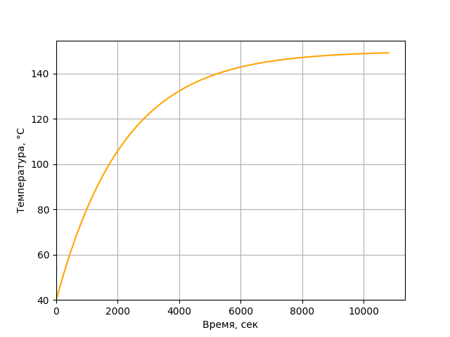
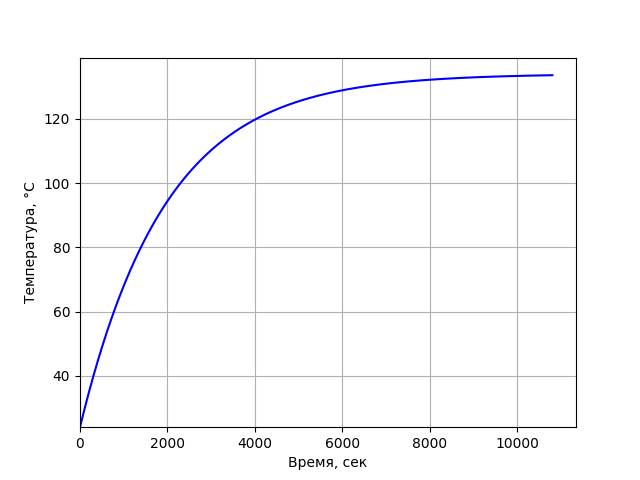
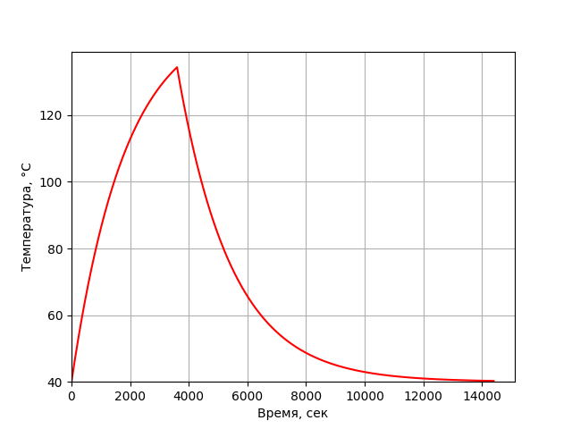

# Исследование тепловых режимов асинхронного двигателя
Исследование теоретических зависимостей превышения температуры двигателя в функции времени при нагревании в режимах S1, S2 и S3.

- [Теория](https://github.com/FaNtic1337/Dependences-of-asynchronous-motor-temperature-exceedance/wiki/%D0%A2%D0%B5%D0%BE%D1%80%D0%B8%D1%8F)
- [Использование](#Использование)

## Использование
В проекте представлена программа **main.py**, позволяющая получить графики функций для различных режимов работы. Для расчета параметров двигателя используется класс **Engine**, куда необходимо задать свои параметры и запустить метод **engine_thermal_calculation**.  

Пример запуска такой программы для двигателя со следующими параметрами:
| Название двигателя | Класс нагревостойкости | Мощность | КПД | Масса |   Частота   | Время работы при S1 | Время работы при S2 | Продолжительность включения |
|:------------------:|:----------------------:|:--------:|:---:|:-----:|:-----------:|:-------------------:|:-------------------:|:---------------------------:|
| AIR100S4           | F                      | 3 кВт    | 82% | 34 кг | 1500 об/мин | 180 мин             | 60 мин              | 40%                         |

На выходе программа покажет и сохранит 4 графика:

Температурный режим S1 при номинальной температуре 40°С и 180 минутах работы:  
  
Температурный режим S1 при температуре охлаждающей среды 24°С и 180 минутах работы:  
  
Температурный режим S2 при постоянной работе в 60 минут:  
  
Температурный режим S3 при продолжительности включения в 40%:  
  
